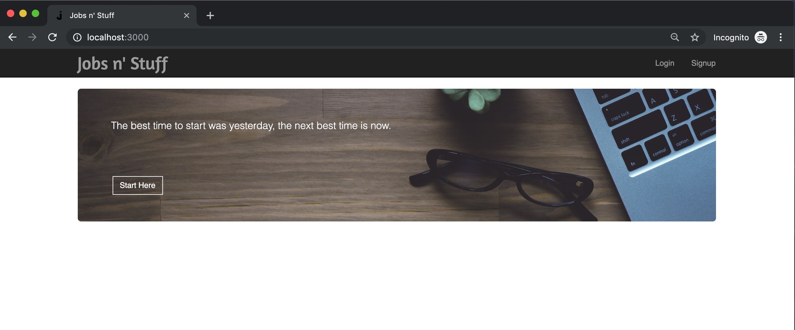
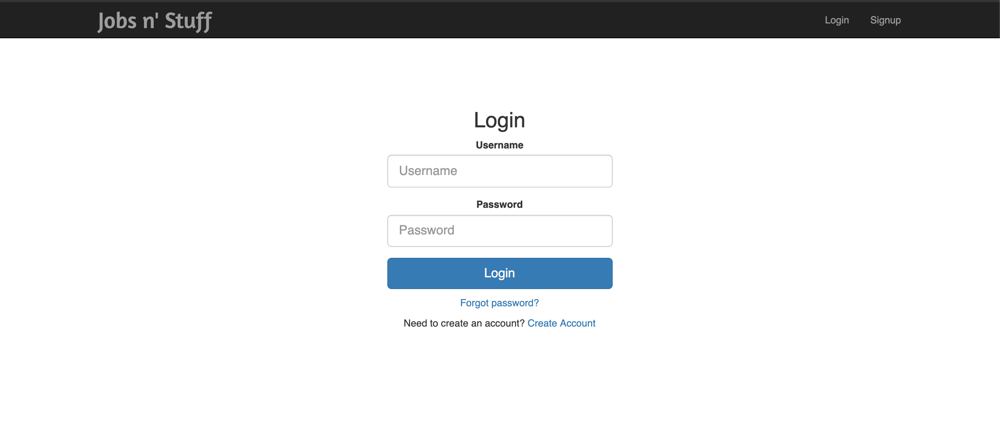
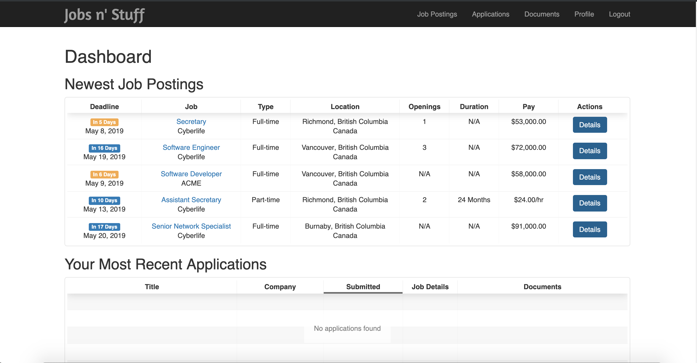
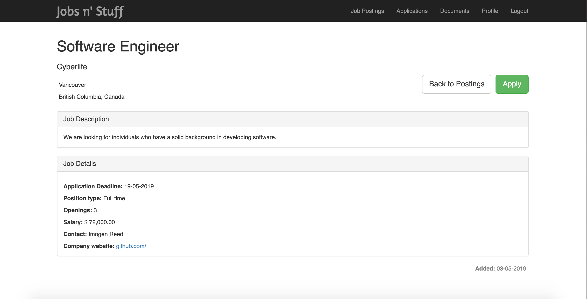
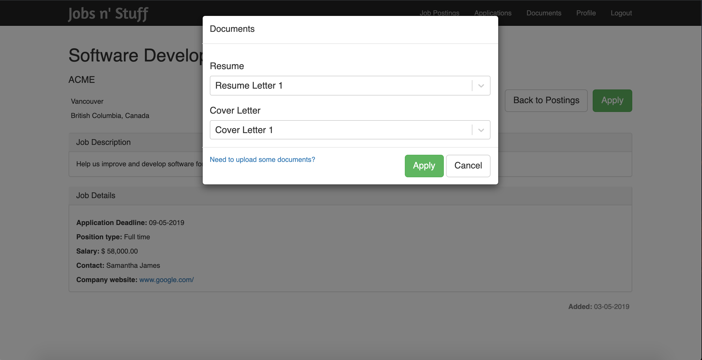
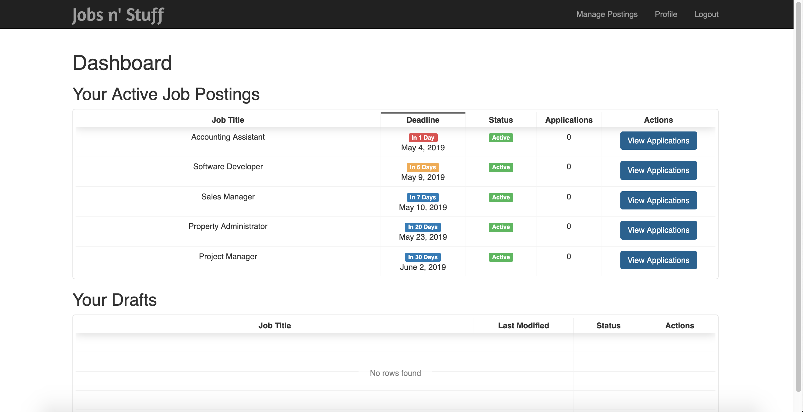
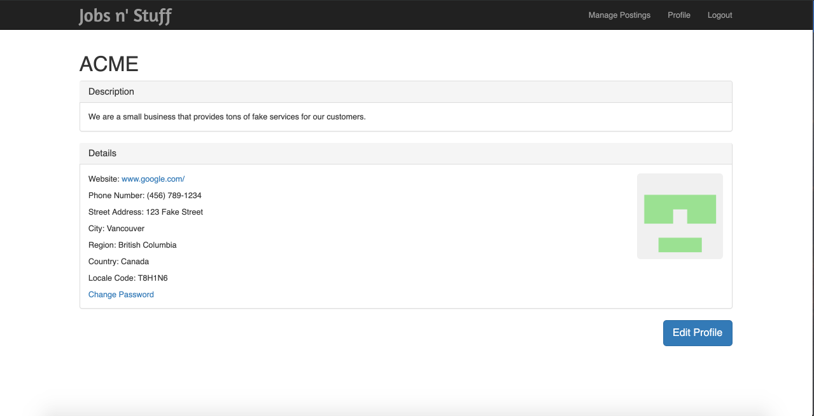
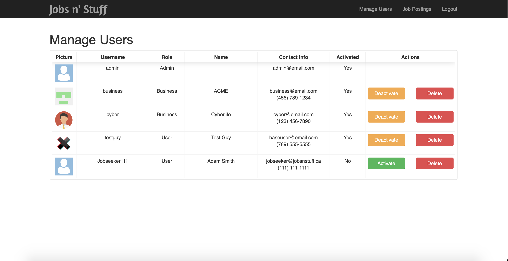

# Jobs n' Stuff

## Instructions:
1. Navigate to cloned folder
2. `vagrant up`
3. Navigate to `localhost:3000` in your web browser

The database has been seeded with four users. 
The following list contains usernames to login as those users. 
(The password for each user is **password**).
* Admin User:
  * Username - admin
* Business Users:
 * Username - business
 * Username - cyber
* Base User:
 * Username - testguy

## Screenshots:

Frontpage
 

Login

User Dashboard

User Perspective of Job Posting

Pick Documents For Applcation

Business's Current Openings 

Business Profile

Admin Perspective

